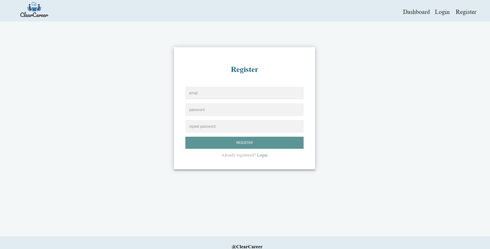
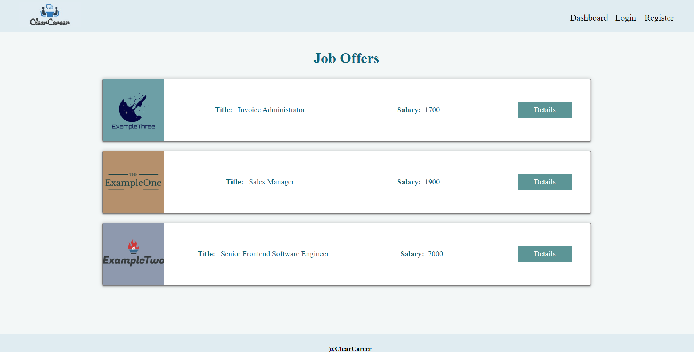
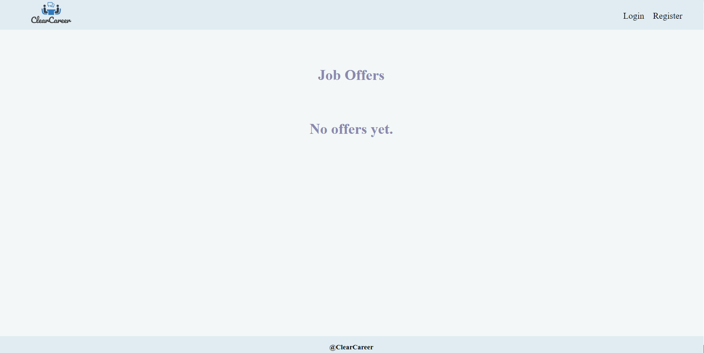
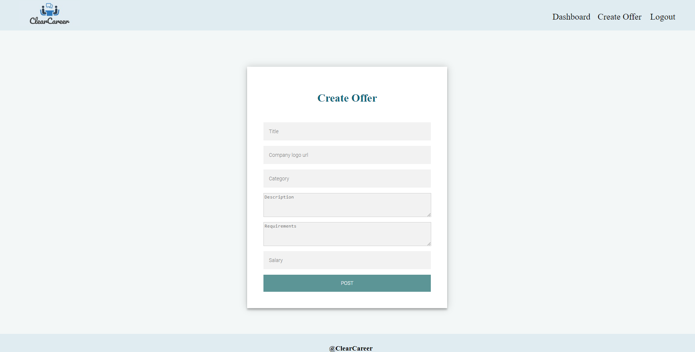
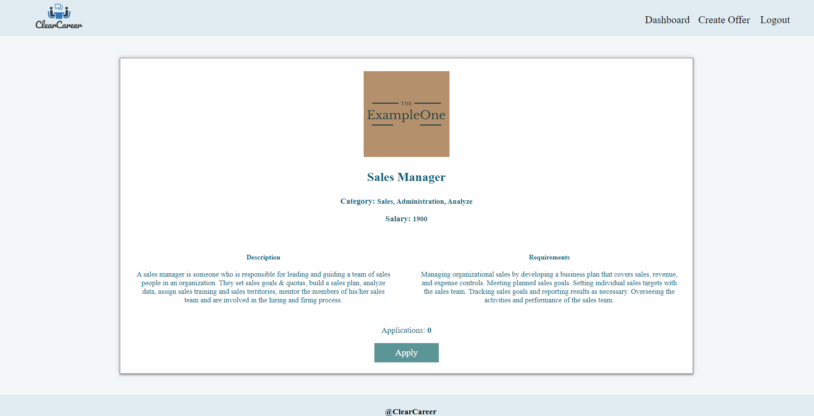

# Requirments - Clear Career
*For details, you can download the word file one folder above*
## Overview
Implement a Single Page Application (SPA) using JavaScript for creating and managing offers. The app allows visitors to browse through the offers catalog, register, create their own offers, and perform CRUD operations using a provided REST service.
## Technical Details
### Project Setup
- Use the provided `package.json` for common dependencies. Do not alter devDependencies and scripts to maintain test compatibility.
- Execute `npm install` to initialize the project.
### HTML and CSS
- Views, including sample user-generated content, are in `index.html`.
- Use any method to display views and navigate between them.
### Local REST Service
- Use the provided server with sample data, supporting user registration and CRUD operations via REST requests.
### Automated Tests
- A complete test suite is included for assessing your solution.
## Application Requirements
### Navigation Bar (5 pts)
Implement a NavBar for the app with navigation links based on user authentication.
* User navigation example:

* Guest navigation example: 

### Home Page (10 pts)
Implement a static Home page for the app.

### Login User (5 pts)
Implement a login page with authentication using a provided REST service.

### Register User (10 pts)
Implement a registration page for new users.

### Logout (5 pts)
Implement logout functionality for logged-in users.
### Dashboard (15 pts)
Display a list of offers, allowing users to click on details for each offer.

### Adding New Offer (15 pts)
Create a form for logged-in users to add new offers.

### Offer Details (10 pts)
Allow all users to view details about offers, with additional options for the offer creator.

### Edit Offer Screen (15 pts)
Allow logged-in users to edit their offers.

### Delete Offer (10 pts)
Allow logged-in users to delete their offers.
### BONUS: Apply on an Offer (15 pts)
Implement the ability for users to apply to offers, with specific conditions.

